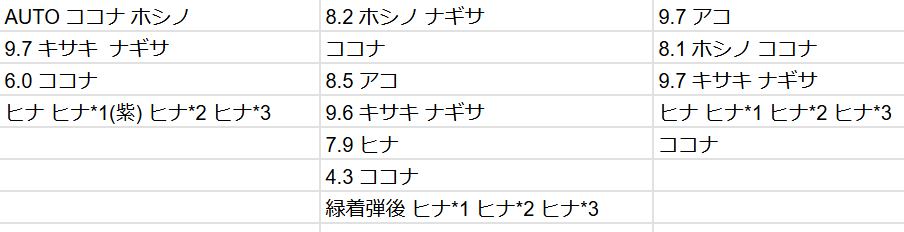

# OCRTest

## 概要

この画像に対して



下記コマンドを実行すると

```bash
$ ./run.bat ./test.png
```

下記tsvが出力されます

```tsv
AUTO	ココナ	ホシノ	8.2ホシノ	-	ナギリ	９.7アコ
9.7 キサキ		ナギリ	ココナ			８.１ホシノ ココナ
6.0 ココナ			8.5ア			9.7キサキ ナギリ
ヒナ	ヒナ*1(紫)	ヒナ*2 ヒナ*3	９.６キサキナギリ			ヒナ ヒナ*1 ヒナ*2 ヒナ*3
			7.9 ヒナ			ココナ
			4.3 ココナ			
			緑着弾後	ヒナ*1	ヒナ*2	ヒナ*3
```

## インストール方法


### Windows

1. [Python 3.10.6](https://www.python.org/downloads/release/python-3106/)をインストールしてください。
   - "Windows installer (64-bit)"からインストーラーをダウンロードします。
   - インストール時に "Add Python to PATH" にチェックを入れます。
2. `git clone https://github.com/kidonaru/OCRTest.git`でリポジトリをクローンします。
3. `setup.bat`を実行してセットアップを行います。
   - `All complete!!! Please press any key...`と表示されれば成功です。適当なキーを押してください。
